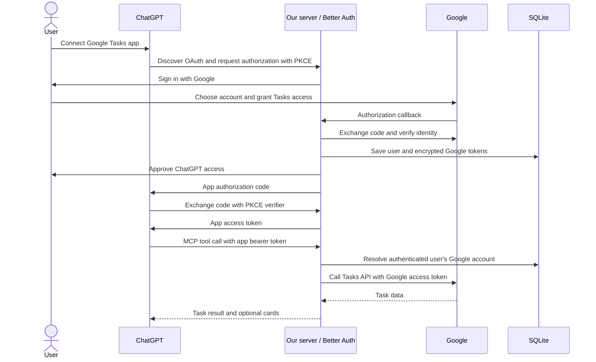

# Authentication and Google integration

Status: local Google sign-in and Tasks integration implemented. Better Auth manages browser sessions and encrypted Google credentials in SQLite. `/api/google/mcp` resolves credentials from the signed-in, allowlisted user; `/mcp` refuses access in Google mode. ChatGPT-facing OAuth and full disconnect/revocation are still planned. The diagram below describes the eventual hosted flow.

## Decisions

Use Better Auth in the existing Node server for Google sign-in, browser sessions, and its OAuth provider for ChatGPT authorization. Use SQLite for this small pilot on one VPS, with a persistent database file and backups. Keep the existing Express transport and shadcn task cards.

The pilot includes personal and outside Google accounts, so configure Google's OAuth audience as External. Initially use Testing and explicitly add participants as test users. Also enforce an application-side email allowlist against Google's verified identity; Google test-user settings alone are not our permanent admission policy.

Better Auth supports [Google sign-in](https://better-auth.com/docs/authentication/google), an [OAuth provider](https://better-auth.com/docs/plugins/oauth-provider), and [SQLite](https://better-auth.com/docs/adapters/sqlite). Pin compatible stable versions when implementing and generate the database schema from that configuration. The newer Better Auth MCP plugin targets MCP SDK v2; evaluate compatibility separately instead of silently upgrading the existing SDK v1 transport during Google sign-in work.

## Two separate authorization relationships

Google issues credentials that let our server access one person's Tasks account. Our authorization server issues different credentials that let ChatGPT call our MCP tools as that person. Google access and refresh tokens never go to ChatGPT, the widget, or tool output.

This follows the [OpenAI authentication guide](https://developers.openai.com/plugins/build/auth): publish OAuth and protected-resource metadata, support authorization-code flow with S256 PKCE, and validate issuer, audience, expiration, and scopes on every MCP request. Prefer CIMD registration where compatible; a predefined OAuth client is an alternative for the private pilot. Register the exact ChatGPT redirect URI supplied by its connection configuration, never a wildcard.

## Google connection

Request `openid`, `email`, `profile`, and `https://www.googleapis.com/auth/tasks`. The [Tasks write scope](https://developers.google.com/workspace/tasks/auth) covers the requested search, creation, editing, and completion operations. Use the verified Google provider subject as the stable account identity. Email is for pilot admission and display, not as a credential selector supplied in tool arguments.

Request offline access so the server can refresh Google credentials. Preserve an existing refresh token when Google omits a new one. Reconnect explicitly when Google revokes or expires the grant. Validate the granted Tasks scope before marking a connection ready. A denied consent or missing scope must never fall back to another account.

Use Better Auth's account-token encryption setting and database-backed OAuth state. Keep provider tokens out of browser account responses and cookies. The application secret stays outside the database and repository; backups require the corresponding secret to restore encrypted credentials. See [Better Auth account options](https://better-auth.com/docs/reference/options).

Each local user has one Google account in the initial release. Disable automatic linking across different identities. Signing in with another Google account creates or selects that account's own application identity.

## Storage and lifecycle

| Data                                                         | Storage and purpose                                                    |
| ------------------------------------------------------------ | ---------------------------------------------------------------------- |
| User and Google subject                                      | SQLite; stable server-side account mapping                             |
| Verified email and name                                      | SQLite; admission checks and connection display                        |
| Google access/refresh tokens and expiry                      | Encrypted account fields in SQLite; API access and refresh             |
| OAuth state, app sessions, clients, grants, and signing keys | Better Auth managed tables and expiry rules                            |
| Tasks                                                        | Google remains the source of truth; no persistent task cache initially |
| Secrets                                                      | Server environment; never frontend configuration                       |

Disconnect must stop local access immediately, invalidate associated application grants/sessions, remove stored Google credentials, and attempt Google grant revocation. Show a recoverable error if Google revocation fails; never resume local access as a consequence. Ordinary browser sign-out only ends that browser session and is distinct from disconnecting Google.

SQLite is a deliberate single-server choice. Store it outside build output and container layers, restrict file permissions to the service account, and use a consistent SQLite backup rather than copying a live database file alone. Reassess storage before running multiple app instances.

## Server and widget boundaries

Keep auth configuration, access verification, Google API calls, and MCP tool registration in separate modules. Resolve a request's principal once from a validated app bearer token. Construct the task service for that principal; neither the model nor the widget can choose a user ID or pass Google credentials.

Real task tools must remove `demoSessionId`. Use `(listId, taskId)` references because Google tasks belong to lists, and add a task-list lookup tool to resolve creation destinations. Do not hard-code the demo Work list. Update the widget result parser to accept authenticated task results and remove its sample badge for real data.

The numeric demo revision is not a Google revision. Carry Google's version information through the task contract and verify conditional-write behavior before promising stale-write protection. Never emulate an atomic conflict check with an unprotected read followed by a write.

Google's [task listing API](https://developers.google.com/workspace/tasks/reference/rest/v1/tasks/list) requires pagination and has no full-text query parameter. Search authorized lists server-side across pages, applying title/notes matching. Return continuation or an explicit incomplete-result signal if a safety limit is reached. Include hidden completed tasks when the user asks for completed items. Keep the UI's calendar-date semantics when mapping Google's date representation.

The local browser test harness will authenticate with a normal browser session through a dedicated development route. Production `/mcp` requires the app bearer token; browser cookies must not become an accidental alternate authorization path. Keep sample mode explicit and unavailable in the production deployment.

## Implementation order and checks

1. Add validated server configuration, Better Auth Google sign-in, a minimal connection page, SQLite migrations, and encrypted token storage.
2. Add the per-user Google Tasks service and test search, list selection, create, edit, complete, reopen, pagination, and date clearing locally.
3. Add the app OAuth provider and protect MCP; adapt tool inputs and widget results to real tasks. Test this locally with an OAuth client before deploying.
4. Deploy to the VPS with a persistent database volume, HTTPS, a canonical public URL, production secrets, and the production Google callback.
5. Connect the hosted endpoint to ChatGPT and test the real conversation and widget together.

Authentication checks must cover denied consent, state mismatch/replay, missing Tasks scope, denied pilot users, invalid/expired/wrong-audience app tokens, refresh failures, disconnect, and restart persistence. Two-user tests must prove that changing IDs in tool inputs cannot read or mutate the other user's data. Verify secrets are absent from tool results and browser responses.

## Required inputs

Google Cloud setup and the local callback are documented in [google-setup.md](google-setup.md). The immediate inputs are a Web application OAuth client ID/secret and the pilot email allowlist. The VPS hostname, SSH/deployment method, reverse proxy, and backup destination are needed at deployment time, not to design local sign-in.

The environment loader and migration command are implemented. See the README for local startup. Google mode is restricted to the configured loopback URLs and production startup is refused until hosted OAuth is added.

## Verified locally on 2026-09-07

- Real Google consent, pilot-account sign-in, encrypted credentials, and credential reuse from a separate server process.
- Task-list lookup, search, creation, note/date edits, field clearing, completion, reopening, and widget rendering/mutations.
- Google rejects stale `If-Match` ETags with HTTP 412.
- Automated tests exercise two real Better Auth identities/sessions against a mocked Google API. Cross-account references fail under the calling user's credentials. Token routes and the public MCP endpoint cannot expose Google data.

The live check left one clearly named integration test task completed. Automatic token refresh uses Better Auth's implementation; revoked/expired grants surface a reconnect error. Forced refresh, full disconnect/revocation, and ChatGPT token validation need additional lifecycle tests before deployment.
